# Software development tools 2º Homework - by Jun Hao Zhu Zhang

This is a [Next.js](https://nextjs.org) project bootstrapped with [`create-next-app`](https://nextjs.org/docs/app/api-reference/cli/create-next-app).

## Task:

### a) create remote repository (at github/gitlab, …)
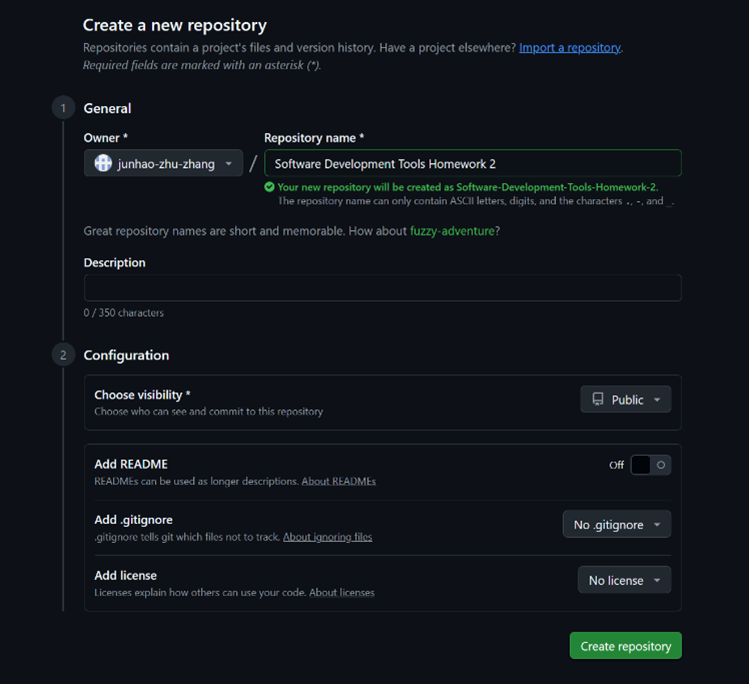
Creation of the repository.

### b) clone the empty repository (git clone)
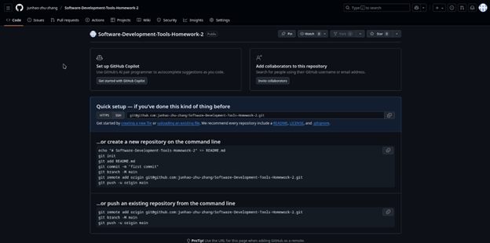
The empty repository with some initial instructions.

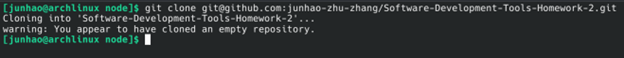
Cloning this repository to a local folder.

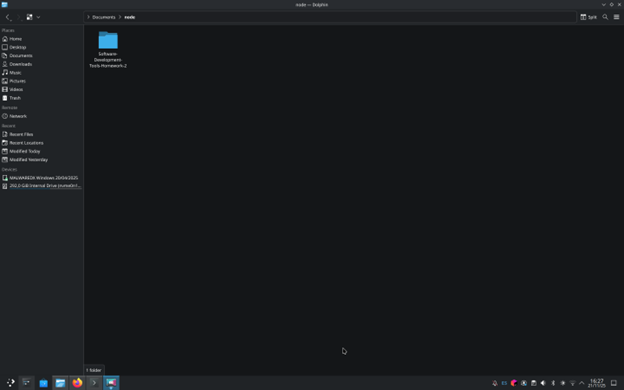
The folder in the local computer with the name of the repository.

### c) create in the local repo folder an empty project using the chosen language
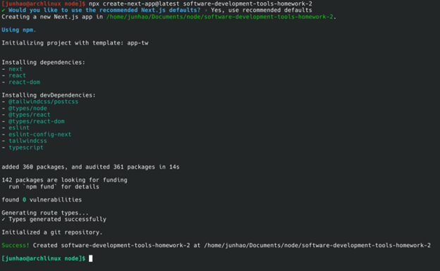
For this project we will use Next.js, a powerful tool for web development creation.
In this screenshot we can see the initialisation of the project.

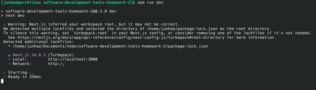
After initialising everything, we use npx to launch the page on our local machine.

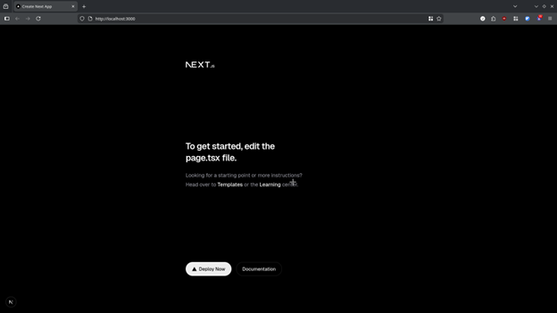
A demonstration of the page launched without modification

### d) commit the whole project to the repo (git commit -m "message …"

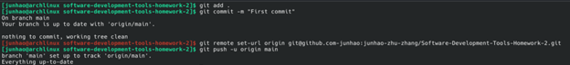
A commit of the project to GitHub.

### e) add simple code to the Java/C++/C# project (e.g. create table, write table elements)

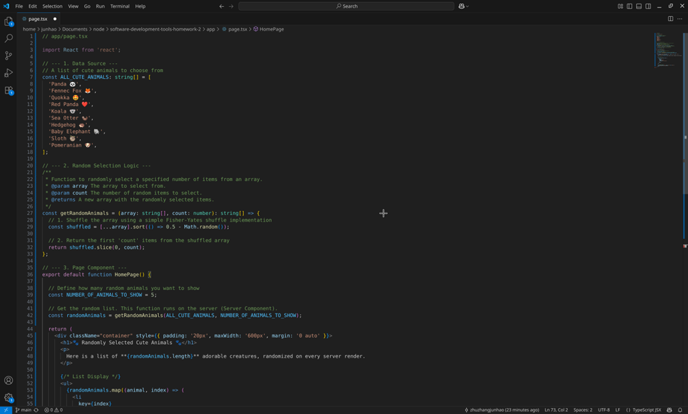
The first version of the code.

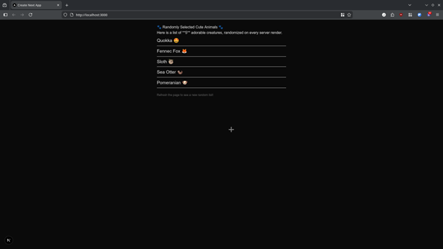
The first version of the web.

### f) commit changes

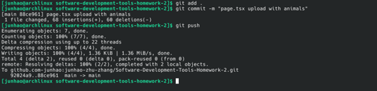
Commit of the first version

### g) add more code (e.g. initlizie table by random values)

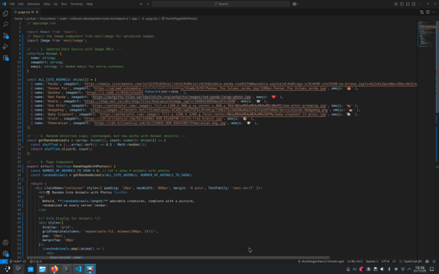
The second version of the code.

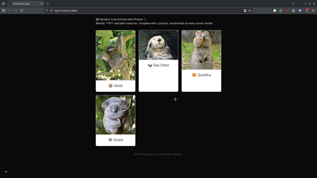
The second version of the web.

### h) commit changes

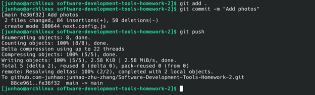
Commit of the second version

### i) add more code (e.g. sort table elements)

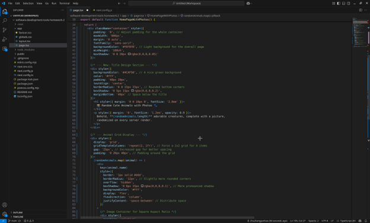
The second version of the code.

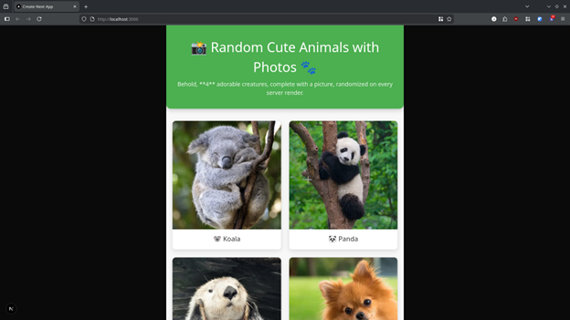
The second version of the web.

### j) commit changes

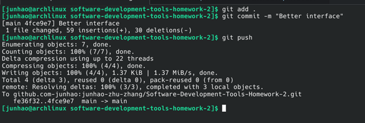
Commit of the third version

### k) look at code history (git log)

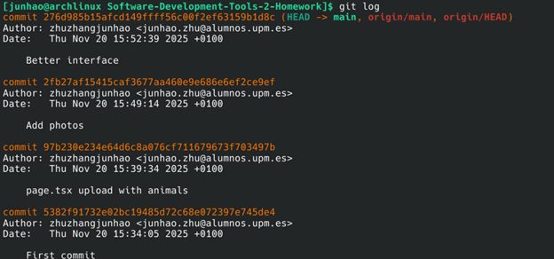
A look at all commits made so far

### l) look at code annotations (git blame)

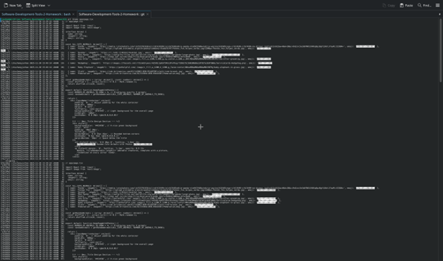
An illegible photo of everything shown with the git blame command

### m) try to checkout different revisions (git checkout)

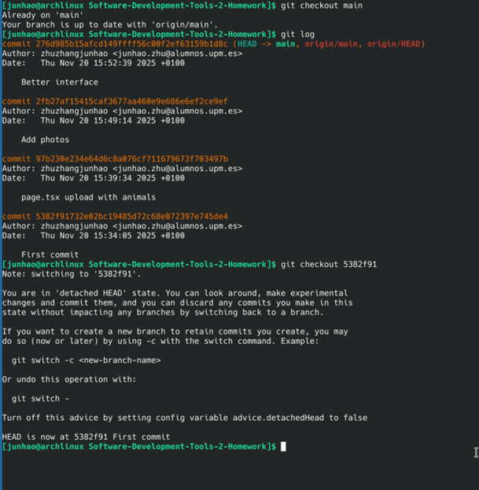
The first command (checkout main) show every commit and where we are situated.
The second command (checkout 5382f91) place the pointer on the desired commit and change the code to that moment.


The page reverts to how it was at the first commit.

## n) add any changes to the code, do not commit

Delete some part of the code randomly.

### o) try to revert the last changes (git revert)
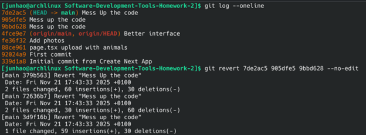
In this part, I made the mistake of committing the code, but I used revert to return to the state where the code worked.

### p) push the project to the remote repo (git push)

Everything is ok.

### r) delete local project and local repo

Local project deleted.

### s) clone project from remote repo (git clone)
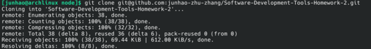
Remote repository cloned.

### t) create tag/realese, try to switch between this tag and master branch (git branch, git tag)

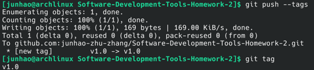
Creation of a tag/realese.

### u) create new branch from the master one

Creation of the branch new-branch.

### w) switch to branch (git merge)
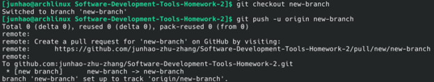
Switch to the branch new-branch.

### x) improve your code in a branch (e.g. change the sorting algorithm)
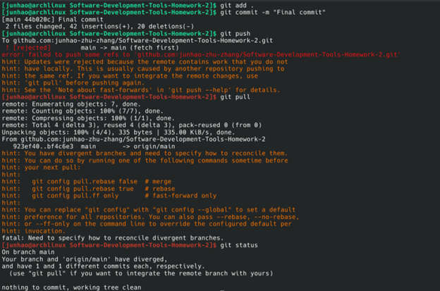
Here we can see that the code has been uploaded to the new branch, however, when we try to push it, we get a conflict.

### y) merge new branch in to the master branch
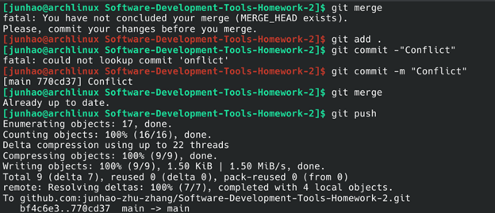
This was quickly resolved by a merge.

### z) give a url to repo to one of your friends (before you have to allow him/her access to this repo)
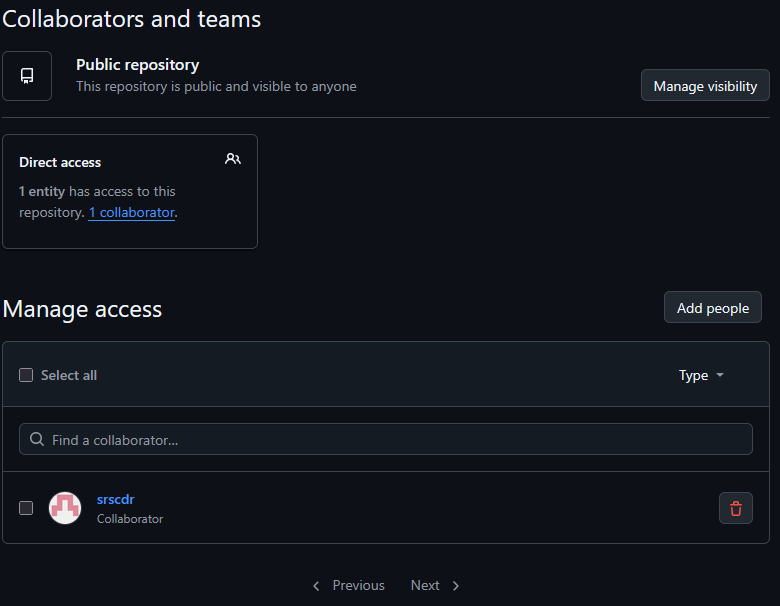
A friend is added to the repository

### z1) try to produce conflict

A conflict appeared when pushing 2 at a time.

### z2) solve it and push the solution to remote repo

The conflict was resolved after combining the changes and performing a merge.

## Instructions for setting up the website

First, run the development server:

```bash
npm run dev
# or
yarn dev
# or
pnpm dev
# or
bun dev
```

Open [http://localhost:3000](http://localhost:3000) with your browser to see the result.

You can start editing the page by modifying `app/page.tsx`. The page auto-updates as you edit the file.

This project uses [`next/font`](https://nextjs.org/docs/app/building-your-application/optimizing/fonts) to automatically optimize and load [Geist](https://vercel.com/font), a new font family for Vercel.

## Learn More

To learn more about Next.js, take a look at the following resources:

- [Next.js Documentation](https://nextjs.org/docs) - learn about Next.js features and API.
- [Learn Next.js](https://nextjs.org/learn) - an interactive Next.js tutorial.

You can check out [the Next.js GitHub repository](https://github.com/vercel/next.js) - your feedback and contributions are welcome!

## Deploy on Vercel

The easiest way to deploy your Next.js app is to use the [Vercel Platform](https://vercel.com/new?utm_medium=default-template&filter=next.js&utm_source=create-next-app&utm_campaign=create-next-app-readme) from the creators of Next.js.

Check out our [Next.js deployment documentation](https://nextjs.org/docs/app/building-your-application/deploying) for more details.
